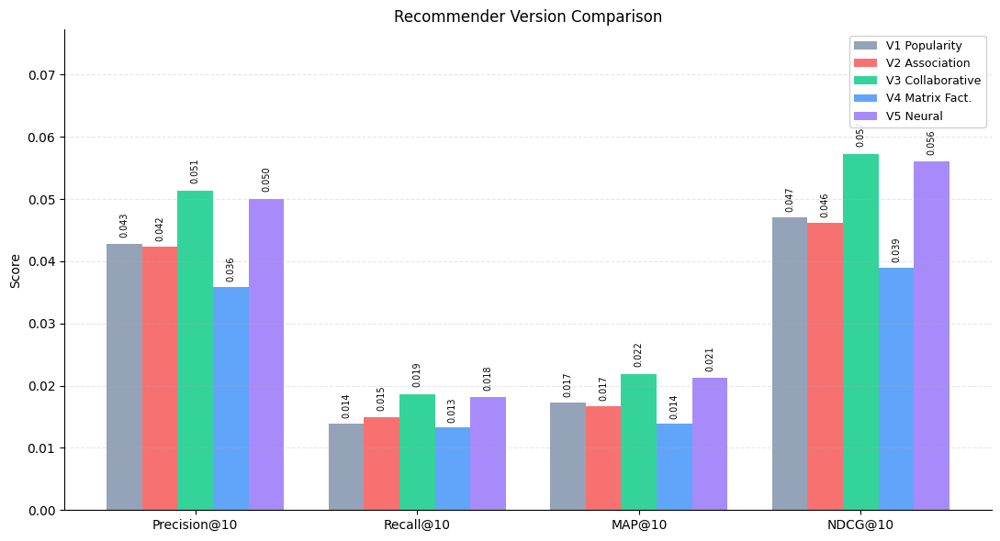

# Product Recommendation System — V1 to V5

A progressive series of product recommenders, each swapping in a more
sophisticated technique while implementing the **exact same API contract**
(`fit`, `recommend`, `evaluate`, `save`, `load`). The shared contract is
enforced by [`tests/test_contract.py`](tests/test_contract.py), which runs
identical assertions against every version.

| Version | Technique | Library |
|---|---|---|
| V1 | Popularity — most purchased products | pandas |
| V2 | Association rules — "people who bought X also bought Y" | scikit-learn / scipy.sparse (item-item co-ocurrence) |
| V3 | Collaborative filtering — "users like you bought..." | scikit-learn (item-based k-NN) |
| V4 | Matrix factorization — latent factors | scikit-learn (TruncatedSVD) |
| V5 | Neural recommendation | TensorFlow / Keras (NCF) |

## Results


| Version | Precision@10 | Recall@10 | MAP@10 | NDCG@10 |
|---|---|---|---|---|
| V1 Popularity |0.0428|0.0139|0.0173|0.0470|
| V2 Association |0.0423|0.0150|0.0167|0.0461|
| V3 Collaborative |0.0513|0.0186|0.0219|0.0572|
| V4 Matrix Factorization |0.0359|0.0133|0.0139|0.0390|
| V5 Neural |0.0500|0.0181|0.0212|0.0560|



## Repo structure

```
ecommerce_reccomendation_engine/
├── src/
│   ├── base.py                    # BaseRecommender — the shared contract
│   ├── metrics.py                 # evaluate_model(), time_based_split()
│   ├── v1_popularity.py
│   ├── v2_association.py
│   ├── v3_collaborative.py
│   ├── v4_matrix_factorization.py
│   └── v5_neural.py
├── tests/
│   └── test_contract.py           
├── data/
│   ├── download_data.py           
│   └── raw/                       
├── models/                        
├── notebooks/                     
├── requirements.txt
└── README.md
```

## The API contract

Every version implements:

```python
model = SomeRecommender(**hyperparams)
model.fit(interactions_df)                    # same input schema for all versions
recs = model.recommend(user_id, n=10)          # -> [{"item_id": ..., "score": float}, ...]
metrics = evaluate_model(model, test_df, k=10) # -> {"precision@10": ..., "recall@10": ..., ...}
model.save("models/v1.pkl")
loaded = SomeRecommender.load("models/v1.pkl")
```

**Interactions DataFrame schema** (input to every `fit()`):

| column | type | notes |
|---|---|---|
| `user_id` | int/str | required |
| `item_id` | int/str | required |
| `order_id` | int/str | required for V2 (groups items into baskets) |
| `timestamp` | datetime | required for time-based splitting |
| `quantity` | numeric | optional, defaults to 1 |

Cold start is handled once, in `BaseRecommender`: any `user_id` unseen
during `fit()` (or a known user with too few candidate recommendations)
automatically falls back to the popularity ranking, so V5 never crashes
on a brand-new user.

## Results & Key Findings

All five versions were evaluated on the same held-out test split (each user's most recent orders, via `time_based_split`), using the same `evaluate_model()` harness, with `exclude_seen=True` so no version could "cheat" by re-recommending something a user had already bought in training.

| Version | Precision@10 | Recall@10 | MAP@10 | NDCG@10 |
|---|---|---|---|---|
| V1 — Popularity | 0.0428 | 0.0139 | 0.0173 | 0.0470 |
| V2 — Association Rules | 0.0423 | 0.0150 | 0.0167 | 0.0461 |
| V3 — Collaborative Filtering | **0.0513** | **0.0186** | **0.0219** | **0.0572** |
| V4 — Matrix Factorization | 0.0359 | 0.0133 | 0.0139 | 0.0390 |
| V5 — Neural (NCF) | 0.0500 | 0.0181 | 0.0212 | 0.0560 |


### Key findings

**V3 (collaborative filtering) was the best-performing version, and by a real margin over every other approach.** Item-based k-NN over purchase co-occurrence outperformed the field on all four metrics, which makes sense for this dataset: Instacart's ground truth is dominated by *reorders*, and modeling per-user item affinity directly is a good fit for "what will this specific user buy again."

**V1, V2, and V4 landed in a tight cluster, essentially indistinguishable from one another** (precision@10 of 0.0428, 0.0423, and 0.0359 respectively). This is a more interesting result than it first appears: three quite different techniques — global popularity, pairwise co-occurrence rules, and latent-factor matrix factorization — converged to nearly the same performance ceiling. The likely explanation is that after tuning V2's thresholds (`min_cooccurrence`, `min_lift`) to filter out statistically unreliable rules, the surviving associations were concentrated among items popular enough to co-occur reliably in the first place — so V2's recommendations ended up correlating heavily with plain popularity, just re-derived through a co-occurrence lens rather than a raw-count one. Similarly, V4's `TruncatedSVD` performed best at low rank (`n_factors=10`), where it has little room to encode anything beyond broad popularity structure, and degraded as rank increased (see below). All three, in effect, are approximating the same "generically well-liked item" signal through different mechanisms.

**V4 (matrix factorization via TruncatedSVD) degraded monotonically as rank increased** (`n_factors` 10 → 25 → 50 → 100), with the best result at the lowest rank tested. This is a known limitation of applying plain SVD to implicit feedback: it has no way to distinguish "explicitly negative" from "simply not yet observed," so more latent dimensions let it fit noise in the sparse purchase matrix rather than real structure. Proper implicit-feedback matrix factorization (confidence-weighted ALS, e.g. Hu/Koren/Volinsky) is the standard fix and is noted below as future work.

**V5 (neural collaborative filtering) essentially tied V3** rather than clearly beating it — a result consistent with recommender systems literature showing that a well-tuned simple baseline often matches considerably more complex neural architectures on tasks like this. Training was stopped once validation loss plateaued (~epoch 7–8 of 15); the model wasn't undertrained, it simply converged to roughly the same ranking quality as item-based k-NN via a very different mechanism (learned embeddings + explicit negative sampling vs. direct co-occurrence similarity).

### Takeaways

- More model complexity did not monotonically improve results. V3, the simplest *personalized* approach, was competitive with or better than every more complex version that followed it, while three structurally different techniques (V1, V2, V4) converged to nearly identical, lower performance.
- Explicitly modeling per-user preference (V3, V5) clearly outperformed methods that only capture item-to-item or global relationships (V1, V2, V4) on this reorder-heavy dataset — the personalization axis mattered more than the sophistication axis.
- Given V3's combination of best metrics *and* by far the cheapest training/inference cost, it's the version I'd actually put into production; V5 would only be worth its added complexity if a different task (e.g. cold-start-heavy catalogs, or incorporating item/user features beyond IDs) played to its strengths.

### Future work

- Replace V4's `TruncatedSVD` with `implicit.als.AlternatingLeastSquares` for proper confidence-weighted implicit-feedback factorization
- Evaluate V2 on a basket-completion task (predicting the next item added to the current cart) rather than next-order prediction, which may better showcase association rules' actual strength in cross-sell scenarios
- Extend V5 to a two-tower architecture incorporating item metadata (aisle, department, price) rather than IDs alone
- Hybrid model combining V3's item similarity with V2's association rules for cold-start items with few purchases but known co-occurrence patterns